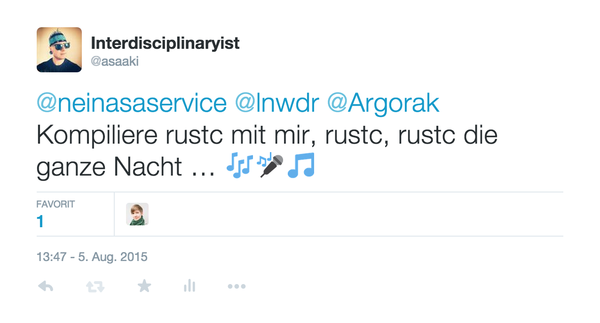
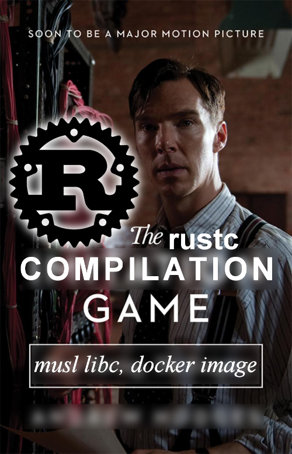

# Rust on _musl_

This setup is based on [rust-lang/rust: advanced-linking.md](https://github.com/rust-lang/rust/blob/4b79add08653d89f08e5a5c94c2132515a1aa30f/src/doc/trpl/advanced-linking.md). (Also thanks to the hints given at [rust-lang/rust#27290](https://github.com/rust-lang/rust/issues/27290#issuecomment-127623898))

And it takes verrrrrrrrrrrrrrrrrrrrrrry long …

Go grab a coffee … shop!

> Bring your children to school.
>
> And have a relaxed stroll afterwards.
>
> Maybe you want to tour the world instead? Go for it!
>
> Perhaps a travel to the moon is possible, too.

Seriously you will need some time and wait a bit.

----

I haven't even written a single useful line of Rust yet.

So why do I bother even with this _musl_ thingy anyways?

Well, I want to build docker images.

Small ones.

Like I did with [EDIP](https://github.com/asaaki/elixir-docker-image-packager).

But now for Rust stuff.

I even think about writing Rust based libraries (instead of C) pluggable into Elixir.

Yes, this was actually my initial idea for it.

But there is a high chance I never do.

Anyways, I learned something from it.

I'm almost two days older after this whole process.

Now you know.

Am I crazy?

A bit.

¯\\\_(ツ)_/¯

